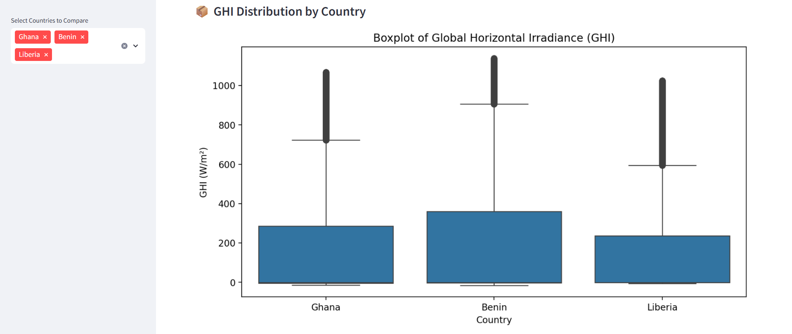
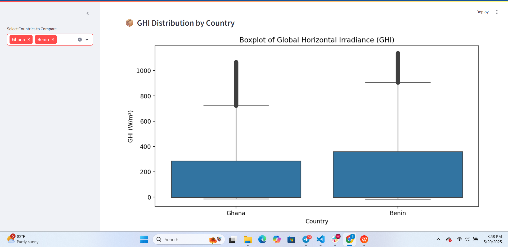
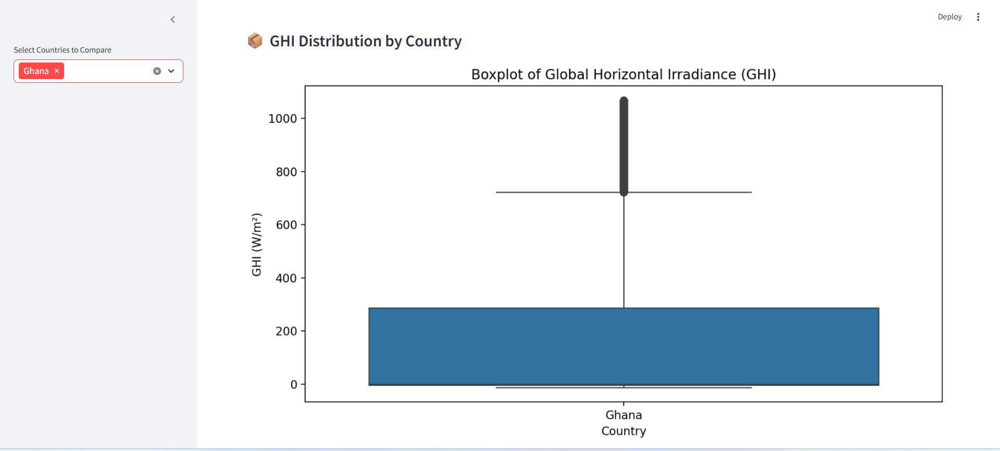
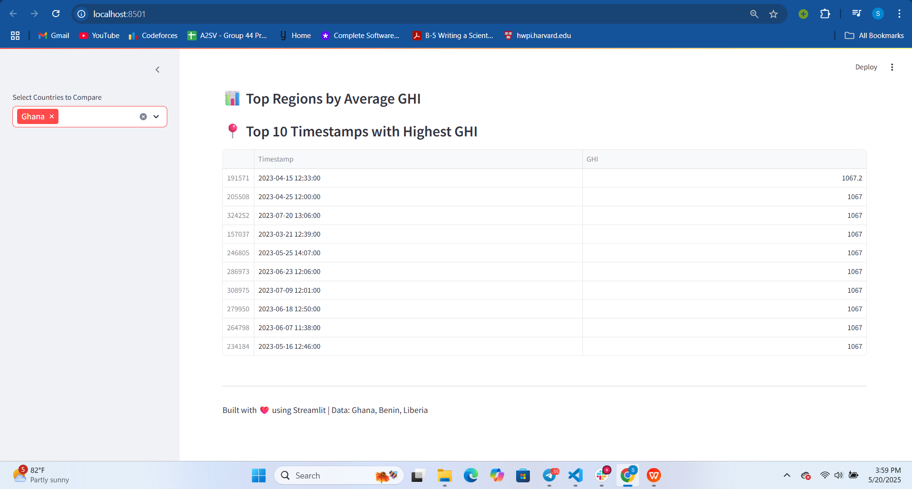

# ☀️ solar-challenge-week1

This interactive **Streamlit dashboard** visualizes solar irradiance data from **Ghana, Benin, and Liberia**. It helps compare Global Horizontal Irradiance (GHI), explore statistical distributions, and view temporal patterns in the dataset.

---

## 📌 Features

- 📊 **Boxplot of GHI** for selected countries.
- ⏱️ **Top timestamps with highest GHI**.
- 📈 Clean, interactive visualizations using Seaborn and Matplotlib.
- 🧪 Easily extendable for statistical tests and more insights.

---

## 🔧 Environment Setup

1. **Clone the repository:**


git clone https://github.com/sossyh/solar-challenge-week1.git

cd solar-challenge-week1

2. **Set up virtual environment:**


python -m venv .venv
.venv\Scripts\activate         # On Windows
# OR
source .venv/bin/activate      # On macOS/Linux

3. **Install required dependencies:**
pip install -r requirements.txt


### Example: GHI Boxplot (dashboard_screenshots)





### Example: Top GHI Timestamps Table



## 📜 License

MIT License — see the [LICENSE](LICENSE) file for details.


```bash
